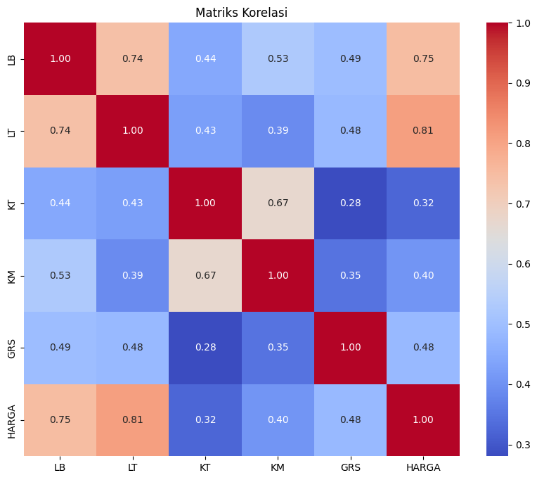
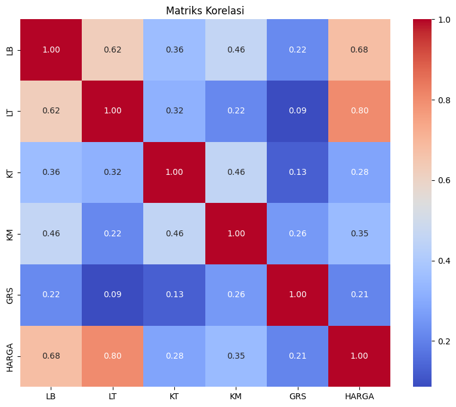

# Laporan Proyek Machine Learning - Raihan Fahlevi
## Domain Proyek
Industri real estate merupakan salah satu sektor ekonomi yang paling signifikan dan dinamis. Harga rumah dipengaruhi oleh berbagai faktor ekonomi, sosial, dan lingkungan. Oleh karena itu, memiliki model prediksi yang akurat untuk harga rumah adalah sangat penting bagi pembeli rumah, penjual, investor, dan perusahaan real estate.

## Business Understanding

### Problem Statements

Menjelaskan pernyataan masalah latar belakang:

- Harga rumah sangat bervariasi dan sulit diprediksi hanya dengan melihatnya. Banyak faktor yang memengaruhi harga rumah, dan sulit bagi pembeli atau penjual untuk memperkirakan harga yang wajar.
- Penentuan harga rumah secara manual membutuhkan waktu dan tenaga yang signifikan. Proses tradisional melibatkan survei fisik, analisis pasar komparatif, dan penilaian ahli, yang bisa mahal dan memakan waktu.

### Goals

Menjelaskan tujuan dari pernyataan masalah:

- Mengembangkan model prediktif yang dapat memperkirakan harga rumah secara akurat berdasarkan karakteristiknya. Model ini akan membantu pembeli dan penjual dalam membuat keputusan yang tepat mengenai harga.
- Otomatiskan proses penilaian rumah dengan memanfaatkan Machine Learning. Ini akan menghemat waktu dan sumber daya, memungkinkan penilaian yang lebih cepat dan lebih efisien.

## Data Understanding

Dataset Harga Rumah merupakan daftar harga rumah yang terbagi menjadi 2 data, yaitu data harga rumah daerah Jaksel dan data harga rumah daerah Tebet. Link download: https://www.kaggle.com/datasets/wisnuanggara/daftar-harga-rumah/data

Selanjutnya uraikanlah seluruh variabel atau fitur pada data. Sebagai contoh:

### Variabel-variabel pada Restaurant UCI dataset adalah sebagai berikut:

Dataset ini berisi informasi mengenai karakteristik rumah dan harga jualnya. Berikut adalah variabel-variabel yang ada:

- `LB`: Luas bangunan rumah dalam meter persegi.
- `LT`: Luas tanah rumah dalam meter persegi.
- `KT`: Jumlah kamar tidur dalam rumah.
- `KM`: Jumlah kamar mandi dalam rumah.
- `GRS`: Apakah rumah memiliki garasi (1) atau tidak (0).
- `HARGA`: Harga jual rumah dalam Rupiah.

## Data Preparation

1. Pemeriksaan Data
   Langkah pertama adalah memeriksa dataset untuk mendapatkan pemahaman tentang karakteristiknya. Ini termasuk:

- df.info(): Untuk melihat informasi umum tentang dataset, seperti jumlah baris, kolom, tipe data, dan nilai yang hilang.
- df.describe(): Untuk mendapatkan statistik deskriptif dari variabel numerik, seperti rata-rata, standar deviasi, nilai minimum, dan maksimum.

2. Penanganan Nilai yang Hilang
   Dataset diperiksa untuk nilai yang hilang menggunakan df.isna().sum(). Tidak ditemukan nilai yang hilang dalam dataset ini.

3. Penanganan Nilai Nol pada Variabel Tertentu
   Variabel LB, LT, KT, dan KM diperiksa untuk nilai nol menggunakan (df.LB == 0).sum() dan seterusnya. Meskipun nilai nol mungkin valid dalam beberapa kasus, penting untuk memastikan bahwa mereka tidak mewakili kesalahan entri data. Jika nilai nol dianggap tidak valid, mereka dapat ditangani dengan cara yang sama seperti nilai yang hilang.

4. Pemisahan Data
   Dataset dibagi menjadi set pelatihan dan pengujian menggunakan train_test_split dengan rasio 80:20. Ini memungkinkan evaluasi kinerja model pada data yang tidak terlihat.

5. Outlier
   Pada dataset ini terdapat outlier tetapi tidak dihapus karena itu akan berpengaruh korelasi data bisa dilihat pada gambar dibawah jika outlier dihapus dan tidak dihapus:

 ### Gambar data jika outlier tidak dihapus:


 ### Gambar data jika outlier dihapus:


## Modeling

Tahapan ini membahas mengenai model machine learning yang digunakan untuk menyelesaikan permasalahan. Anda perlu menjelaskan tahapan dan parameter yang digunakan pada proses pemodelan.

### 1. XGBoost
A. Inisialisasi Model XGBoost
Model XGBoost: Menggunakan xgboost.XGBRegressor yang diinisialisasi dengan parameter dasar.
   ```
   xgb_model = xgb.XGBRegressor(objective='reg:squarederror', random_state=42)
   ```
random_state=42: Menetapkan seed acak untuk memastikan hasil yang konsisten setiap kali kode dijalankan.

B. Melatih Model
Latih Model: Model dilatih menggunakan data pelatihan
   ```
   xgb_model.fit(X_train, y_train)
   ```
   
C. Prediksi
Prediksi Data Latih dan Uji: Model digunakan untuk memprediksi nilai pada data pelatihan dan data uji.
   ```
y_train_pred = xgb_model.predict(X_train)
y_test_pred = xgb_model.predict(X_test)
   ```

D. Hyperparameter Tuning
- Model dengan Parameter Dasar: Menggunakan parameter dasar seperti n_estimators, max_depth, dan learning_rate.
   ```
   xgb_model = xgb.XGBRegressor(
    objective='reg:squarederror',
    random_state=42,
    n_estimators=100,  # Jumlah pohon
    max_depth=3,       # Kedalaman maksimum pohon
    learning_rate=0.1  # Laju pembelajaran
   )
   ```

- Definisikan Grid Parameter: Menetapkan berbagai kombinasi parameter untuk dicoba.
   ```
   param_grid = {
    'learning_rate': [0.01, 0.1, 0.2],
    'max_depth': [2, 3, 4],
    'n_estimators': [50, 100, 150]
   }
   ```
- Grid Search: Mencari kombinasi parameter terbaik menggunakan GridSearchCV.
   ```
   grid_search = GridSearchCV(
    estimator=xgb_model,
    param_grid=param_grid,
    scoring='neg_mean_squared_error',  # Gunakan MSE negatif untuk mencari nilai terkecil
    cv=5,  # 5-fold cross-validation
    verbose=1  # Tampilkan progres pencarian
   )
   ```

- Latih GridSearchCV: Mencari parameter terbaik pada data pelatihan.
   ```
   grid_search.fit(X_train, y_train)
   ```

### Random Forest
A. Inisialisasi Model:
`RandomForestRegressor(random_state=123)`: Membuat model Random Forest dengan parameter random_state untuk memastikan hasil yang konsisten setiap kali kode dijalankan.

B. Pelatihan Model: 
`rf_model.fit(X_train, y_train)`: Melatih model menggunakan data pelatihan (`X_train` dan `y_train`).

C. Prediksi:
`rf_model.predict(X_train)`: Membuat prediksi untuk data pelatihan.
`rf_model.predict(X_test)`: Membuat prediksi untuk data pengujian.


## Kelebihan dan Kekurangan Algoritma:
### XGBoost
- Kelebihan: Akurasi tinggi, penanganan data yang hilang, regularisasi untuk mencegah overfitting, dan kecepatan yang baik.
- Kekurangan: Dapat menjadi kompleks untuk hyperparameter tuning, rentan terhadap overfitting jika tidak dikonfigurasi dengan benar.

### Random Forest
- Kelebihan: Robust terhadap overfitting, dapat menangani data non-linear, dan dapat digunakan untuk feature importance selection.
- Kekurangan: Kurang akurat dibandingkan XGBoost dalam beberapa kasus, dapat menjadi lambat untuk dataset besar.

## Evaluation

Metrik yang digunakan pada project ini adalah 
**Mean Absolue Error (MAE), Mean Squared Error (MSE), dan R-squared**

- **Mean Absolute Error (MAE)**: Mengukur rata-rata selisih absolut antara nilai prediksi dan nilai sebenarnya. MAE memberikan gambaran umum tentang seberapa jauh prediksi dari nilai sebenarnya. Semakin kecil nilai MAE, semakin baik kinerja model.
**Mean Squared Error (MSE)**: Mengukur rata-rata kuadrat selisih antara nilai prediksi dan nilai sebenarnya. MSE memberikan penalti yang lebih besar untuk kesalahan yang lebih besar. Semakin kecil nilai MSE, semakin baik kinerja model.
**R2 Score**: Mengukur seberapa baik model cocok dengan data. Nilai R2 Score berkisar antara 0 hingga 1, di mana 1 menunjukkan kesesuaian yang sempurna. Semakin tinggi nilai R2 Score, semakin baik model dalam menjelaskan variasi data.

### Model XGBoost
**Evaluasi pada Data Pelatihan**:
MAE: 1,469,339,139.4591584
MSE: 6.934707093962935e+18
R2 Score: 0.8752894282801635

**Evaluasi pada Data Pengujian**:
MAE: 1,775,984,023.5
MSE: 8.609931393182666e+18
R2 Score: 0.8155652739886136

Hasil: 
**MAE** yang tinggi menunjukkan bahwa prediksi rata-rata model memiliki kesalahan absolut sebesar sekitar 1.47 miliar pada data pelatihan dan 1.78 miliar pada data pengujian.
**MSE** yang tinggi menunjukkan adanya beberapa prediksi dengan kesalahan besar, karena MSE memperbesar pengaruh dari kesalahan besar.
**R2 Score** pada data pelatihan (0.875) dan pengujian (0.816) menunjukkan bahwa model ini dapat menjelaskan sekitar 87.5% variabilitas data pada pelatihan dan 81.6% pada pengujian. Meskipun ada penurunan performa pada data pengujian, penurunan ini tidak terlalu drastis, menunjukkan model yang cukup robust.

### Model Random Forest
**Evaluasi pada Data Pelatihan**:
MAE: 676,085,395.3969383
MSE: 2.437404949029554e+18
R2 Score: 0.9561668343612005

**Evaluasi pada Data Pengujian**:
MAE: 1,766,550,038.426072
MSE: 1.0078563535210017e+19
R2 Score: 0.7841054685201516

Hasil:
**MAE** yang lebih rendah pada data pelatihan menunjukkan bahwa model ini memiliki kesalahan rata-rata yang lebih kecil, sekitar 676 juta pada data pelatihan dan 1.77 miliar pada data pengujian.
**MSE** yang lebih rendah pada data pelatihan menunjukkan bahwa model ini lebih baik dalam mengurangi pengaruh dari kesalahan besar pada data pelatihan. Namun, pada data pengujian, MSE lebih tinggi daripada XGBoost.
**R2 Score** yang sangat tinggi pada data pelatihan (0.956) menunjukkan bahwa model ini dapat menjelaskan 95.6% variabilitas data pada pelatihan. Namun, R² Score yang menurun pada data pengujian (0.784) menunjukkan adanya overfitting, di mana model sangat baik dalam mempelajari data pelatihan tetapi kurang generalisasi pada data pengujian.

## Kesimpulan
**Random Forest** menunjukkan performa yang sangat baik pada data pelatihan dengan MAE dan MSE yang lebih rendah serta R² Score yang lebih tinggi dibandingkan dengan XGBoost. Namun, adanya penurunan performa yang signifikan pada data pengujian menunjukkan adanya overfitting.

**XGBoost** menunjukkan performa yang lebih stabil pada data pengujian dengan penurunan performa yang tidak terlalu drastis dibandingkan dengan data pelatihan, menunjukkan model yang lebih robust dan mampu melakukan generalisasi yang lebih baik pada data pengujian.

Berdasarkan hasil evaluasi ini, XGBoost lebih direkomendasikan untuk digunakan dalam prediksi harga rumah pada dataset ini karena kemampuannya dalam generalisasi yang lebih baik dibandingkan dengan Random Forest. Meskipun Random Forest menunjukkan performa yang sangat baik pada data pelatihan, overfitting yang terjadi membuatnya kurang ideal untuk digunakan pada data baru yang tidak terlihat sebelumnya.
